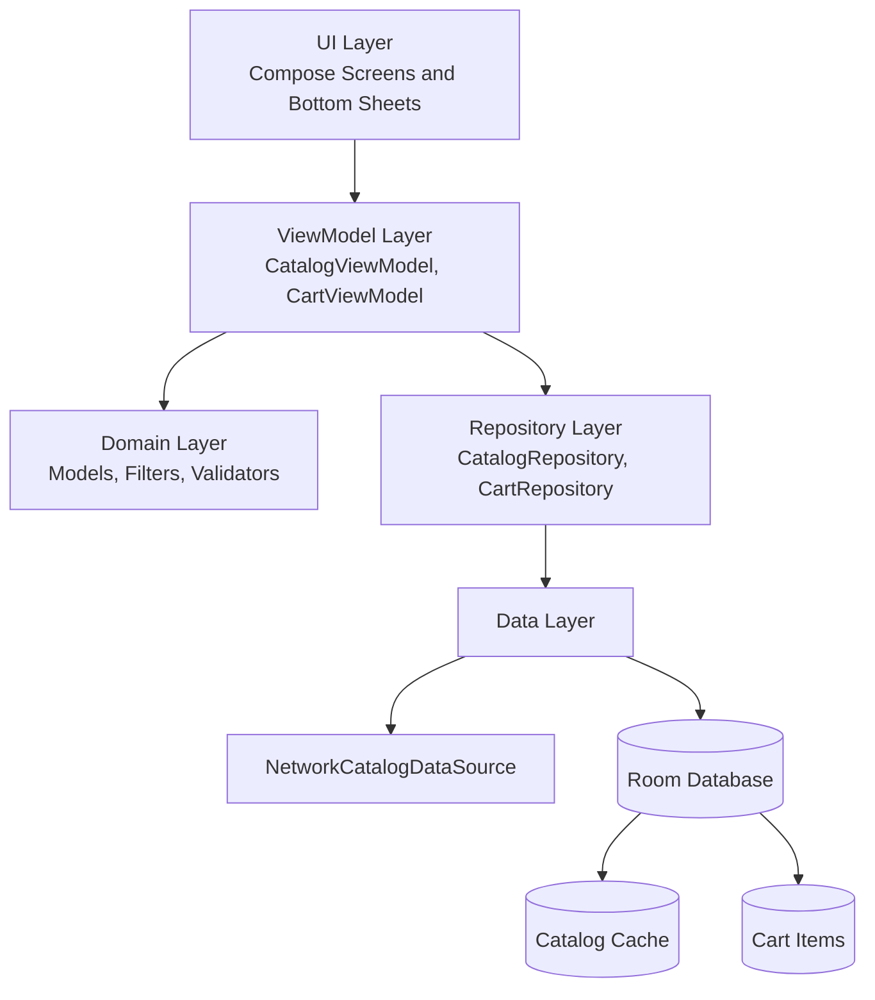

# FEFU Store — team-kotodev

Мобильное приложение интернет-магазина одежды, разработанное в рамках курса мобильной разработки.

Приложение позволяет просматривать каталог товаров, открывать подробную карточку товара, выбирать размер, добавлять товары в корзину, изменять количество позиций, оформлять заказ и работать с каталогом в оффлайн-режиме.

---

## Содержание

- [О проекте](#о-проекте)
- [Скриншоты](#скриншоты)
- [Реализованный функционал](#реализованный-функционал)
- [Архитектура](#архитектура)
- [Стек технологий](#стек-технологий)
- [Структура проекта](#структура-проекта)
- [Сборка и запуск](#сборка-и-запуск)
- [Линтер](#линтер)
- [Тесты](#тесты)
- [Проверка перед сдачей](#проверка-перед-сдачей)

---

## О проекте

**FEFU Store** — учебное Android-приложение интернет-магазина одежды.

Основной сценарий приложения:

1. Пользователь открывает каталог товаров.
2. Каталог загружается из API и кэшируется в локальную базу данных.
3. При отсутствии сети приложение отображает сохранённый каталог.
4. Пользователь открывает карточку товара в bottom sheet.
5. Пользователь выбирает размер и добавляет товар в корзину.
6. Корзина сохраняется локально в Room.
7. Пользователь изменяет количество товаров, удаляет позиции или очищает корзину.
8. Пользователь вводит имя, email, комментарий и оформляет заказ.
9. После успешного оформления корзина очищается, а приложение показывает сообщение об успешном заказе.

---

## Скриншоты

> Скриншоты должны лежать в папке `screenshots` в корне проекта.

| Каталог | Детали товара | Корзина |
|--------|---------------|---------|
|  |  |  |

| Корзина без заполненных данных | Успешное оформление заказа |
|-------------------------------|-----------------------------|
|  |  |

---

## Реализованный функционал

### Каталог

- Загрузка каталога товаров из API.
- Авторизация API-запроса через Bearer token.
- Отображение товаров по категориям.
- Поддержка категории «Новинки» на основе тега товара.
- Отображение состояния загрузки.
- Отображение состояния ошибки с возможностью повторить запрос.
- Отображение баннера «Нет сети» при отсутствии подключения.

### Оффлайн-режим

- Каталог кэшируется в локальную базу данных Room.
- Реализована стратегия cache-first:
  - сначала отображаются данные из локального кэша;
  - параллельно выполняется запрос к API;
  - при успешном ответе кэш и UI обновляются.
- При отсутствии сети и наличии кэша приложение продолжает показывать каталог.
- Если кэш пустой и сети нет, отображается корректное состояние ошибки.

### Детали товара

- Открытие bottom sheet при нажатии на товар.
- Отображение:
  - изображения товара;
  - названия;
  - описания;
  - цены;
  - тегов;
  - размеров;
  - характеристик товара.
- Выбор размера.
- Добавление выбранного размера товара в корзину.
- Диалог с дополнительной информацией о товаре:
  - материал;
  - вес;
  - сезон;
  - страна производства.

### Корзина

- Добавление товара в корзину из bottom sheet.
- Повторное добавление того же товара с тем же размером увеличивает количество.
- Если выбран другой размер, создаётся отдельная позиция корзины.
- Бейдж на иконке корзины показывает количество товаров.
- Бейдж обновляется при изменении содержимого корзины.
- Экран корзины содержит:
  - список добавленных товаров;
  - изображение товара;
  - название;
  - размер;
  - цену с учётом количества;
  - кнопки `−` и `+`;
  - кнопку удаления позиции;
  - общую стоимость корзины.
- Реализована очистка корзины через модальное окно подтверждения.
- Реализован empty state для пустой корзины.

### Хранение корзины

Корзина сохраняется в Room.

В таблице корзины хранятся только минимальные данные:

- `productId`;
- `sizeId`;
- `quantity`.

Отображаемое содержимое корзины собирается из двух источников:

- сохранённые позиции корзины;
- данные каталога.

### Оформление заказа

- Поля для ввода:
  - имени;
  - email;
  - комментария к заказу.
- Валидация имени:
  - имя не должно быть пустым.
- Валидация email:
  - email должен соответствовать простой структуре email.
- Кнопка «Оформить» отключена, если имя не заполнено или email невалидный.
- После успешного оформления:
  - корзина очищается;
  - отображается bottom sheet с сообщением об успешном оформлении заказа;
  - пользователь может вернуться на главный экран.

### Качество

- Настроен `ktlint`.
- Добавлены unit-тесты на бизнес-логику:
  - расчёт суммы корзины;
  - расчёт количества товаров;
  - валидация оформления заказа;
  - фильтрация товаров;
  - построение категории «Новинки»;
  - маппинг данных товара.

---

## Архитектура

Проект построен на архитектуре **MVVM** с использованием паттерна **Repository**.



### Слои приложения

| Слой | Назначение |
|------|------------|
| `ui` | Compose-экраны, bottom sheet, UI-состояния и ViewModel |
| `domain` | Доменные модели и бизнес-логика |
| `data` | Работа с API, Room, DAO, Entity и Repository |
| `di` | Ручное создание зависимостей приложения |
| `util` | Утилитарные функции, например форматирование цены |

### Основные компоненты

| Компонент | Ответственность |
|----------|-----------------|
| `CatalogScreen` | Отображение каталога товаров |
| `ProductDetailsBottomSheet` | Отображение подробной информации о товаре |
| `CartScreen` | Отображение корзины и оформление заказа |
| `CatalogViewModel` | Управление состоянием каталога |
| `CartViewModel` | Управление состоянием корзины и формы заказа |
| `CatalogRepository` | Получение и обновление каталога |
| `CartRepository` | Работа с локальной корзиной |
| `NetworkCatalogDataSource` | Загрузка каталога из API |
| `StoreDatabase` | Room-база данных приложения |
| `CatalogDao` | Работа с кэшем каталога |
| `CartDao` | Работа с сохранёнными позициями корзины |

---

## Стек технологий

| Назначение | Технология |
|-----------|------------|
| Язык | Kotlin |
| Платформа | Android |
| UI | Jetpack Compose |
| Компоненты UI | Material 3 |
| Архитектура | MVVM |
| Хранение данных | Room |
| Асинхронность | Kotlin Coroutines, Flow |
| Загрузка изображений | Coil |
| Сеть | HttpURLConnection |
| DI | Ручной dependency injection через `AppContainer` |
| Линтер | ktlint |
| Unit-тесты | JUnit |

---

## Структура проекта

```text
app/src/main/java/ru/fefu/store
├── data
│   ├── connectivity
│   │   └── ConnectivityObserver.kt
│   ├── database
│   │   ├── CartDao.kt
│   │   ├── CartItemEntity.kt
│   │   ├── CatalogDao.kt
│   │   ├── CategoryEntity.kt
│   │   ├── ProductEntity.kt
│   │   └── StoreDatabase.kt
│   ├── network
│   │   ├── CatalogApiException.kt
│   │   └── NetworkCatalogDataSource.kt
│   └── repository
│       ├── CachedCatalogRepository.kt
│       ├── CartRepository.kt
│       ├── CatalogRepository.kt
│       ├── CatalogRefreshResult.kt
│       └── RoomCartRepository.kt
├── di
│   └── AppContainer.kt
├── domain
│   ├── catalog
│   │   ├── CatalogCategoryBuilder.kt
│   │   └── CatalogFilters.kt
│   ├── checkout
│   │   └── CheckoutValidator.kt
│   └── model
│       ├── CartData.kt
│       ├── CartLineItem.kt
│       ├── CatalogData.kt
│       ├── Category.kt
│       ├── Product.kt
│       └── ProductSize.kt
├── ui
│   ├── cart
│   │   ├── CartScreen.kt
│   │   ├── CartUiState.kt
│   │   └── CartViewModel.kt
│   ├── catalog
│   │   ├── CatalogScreen.kt
│   │   ├── CatalogUiState.kt
│   │   └── CatalogViewModel.kt
│   ├── product
│   │   ├── ProductDetailsBottomSheet.kt
│   │   └── ProductInfoDialog.kt
│   └── theme
├── util
│   └── PriceFormatter.kt
├── MainActivity.kt
├── StoreApp.kt
└── StoreApplication.kt
```

Тесты расположены в:

```text
app/src/test/java/ru/fefu/store
├── TestFixtures.kt
├── data
│   └── database
│       └── ProductEntityMappingTest.kt
└── domain
    ├── catalog
    │   ├── CatalogCategoryBuilderTest.kt
    │   └── CatalogFiltersTest.kt
    ├── checkout
    │   └── CheckoutValidatorTest.kt
    └── model
        └── CartDataTest.kt
```

---

## Сборка и запуск

### Требования

Для сборки проекта необходимы:

- Android Studio;
- JDK 17 или новее;
- Android SDK;
- Gradle Wrapper из проекта;
- устройство или эмулятор Android.

### Клонирование проекта

```bash
git clone https://github.com/FEIP-FEFU-Mobile-Spring-2026/team-kotodev.git
cd team-kotodev
```

### Сборка debug-версии

Windows:

```bash
gradlew.bat assembleDebug
```

macOS/Linux:

```bash
./gradlew assembleDebug
```

### Запуск приложения

1. Открыть проект в Android Studio.
2. Дождаться Gradle Sync.
3. Выбрать эмулятор или физическое устройство.
4. Нажать `Run`.

---

## Линтер

В проекте настроен `ktlint`.

### Проверка форматирования

Windows:

```bash
gradlew.bat ktlintCheck
```

macOS/Linux:

```bash
./gradlew ktlintCheck
```

### Автоформатирование

Windows:

```bash
gradlew.bat ktlintFormat
```

macOS/Linux:

```bash
./gradlew ktlintFormat
```

---

## Тесты

В проекте добавлены unit-тесты на бизнес-логику.

Проверяются:

- расчёт общего количества товаров в корзине;
- расчёт общей стоимости корзины;
- расчёт стоимости позиции корзины;
- валидация имени;
- валидация email;
- доступность оформления заказа;
- фильтрация товаров по категории;
- фильтрация товаров для категории «Новинки»;
- добавление категории «Новинки» при наличии новых товаров;
- отсутствие дублирования категории «Новинки»;
- маппинг `Product` → `ProductEntity` → `Product`.

### Запуск unit-тестов

Windows:

```bash
gradlew.bat testDebugUnitTest
```

macOS/Linux:

```bash
./gradlew testDebugUnitTest
```

---

## Проверка перед сдачей

Перед созданием pull request рекомендуется выполнить:

Windows:

```bash
gradlew.bat ktlintCheck
gradlew.bat testDebugUnitTest
gradlew.bat assembleDebug
```

macOS/Linux:

```bash
./gradlew ktlintCheck
./gradlew testDebugUnitTest
./gradlew assembleDebug
```

Ожидаемый результат:

```text
BUILD SUCCESSFUL
```

---

## Git workflow

Рекомендуемые команды для финального блока:

```bash
git checkout -b hw6-quality-docs
```

```bash
git add .
git commit -m "build: configure ktlint"
```

```bash
git add .
git commit -m "test: add unit tests for business logic"
```

```bash
git add README.md screenshots
git commit -m "docs: update readme with screenshots and architecture"
```

```bash
git push origin hw6-quality-docs
```

---

## Статус проекта

Проект доведён до финального состояния:

- каталог загружается из API;
- каталог работает в оффлайн-режиме;
- каталог кэшируется в Room;
- корзина сохраняется в Room;
- оформление заказа реализовано;
- бейдж корзины обновляется автоматически;
- добавлены unit-тесты;
- настроен ktlint;
- оформлен README;
- проект готов к проверке блока 6.
